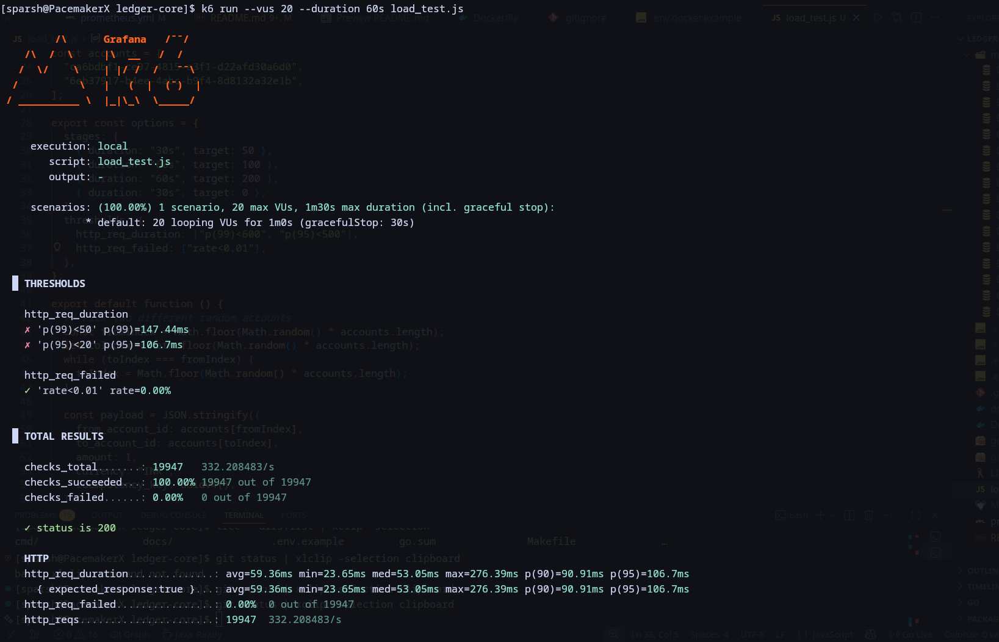
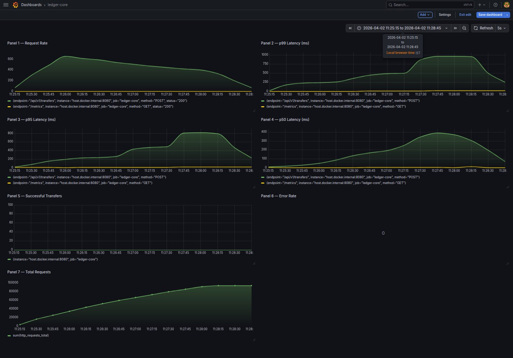

# ledger-core

A production-grade double-entry accounting ledger built in Go and PostgreSQL.
Handles concurrent transfers with full ACID guarantees, idempotency, partial refunds, and real-time observability.

[](https://golang.org/)
[](https://postgresql.org/)
[](https://swagger.io/)
[](https://prometheus.io/)
[](https://grafana.com/)
[](https://sentry.io/)
[](https://k6.io/)
[]()
[]()
[]()
[]()
[]()
[]()
[](LICENSE)

## What is ledger-core?

ledger-core implements the same core accounting principles used by Razorpay, Stripe, and Zerodha — double-entry bookkeeping where every financial movement creates balanced journal entries that are mathematically verifiable.

Every rupee that moves through the system is tracked across four journal entries. The ledger is always consistent. Bugs in financial logic are caught before they commit.


## Architecture

```bash
HTTP Request
     ↓
Handler         — parses JSON, maps errors to HTTP status codes
     ↓
Service         — business logic, orchestrates repositories
     ↓
Interfaces      — ports (hexagonal architecture)
     ↓
Postgres        — adapters, all SQL lives here
```

**Hexagonal architecture** — the service layer has zero knowledge of PostgreSQL.
Repositories can be swapped (MySQL, SQLite) without touching business logic.

## Project Structure

```bash
.
├── cmd
│   └── server
│       └── main.go
├── config
│   └── config.go
├── docs
│   ├── adr
│   │   ├── 000-template.md
│   │   ├── 001-why-go.md
│   │   ├── 002-why-postgreSQL.md
│   │   ├── 003-why-pgx.md
│   │   ├── 004-why-chi.md
│   │   ├── 005-why-zap.md
│   │   ├── 006-why-uuid.md
│   │   ├── 007-why-golang-migrate-over-gorm-automigrate.md
│   │   ├── 008-why-double-entry-accounting.md
│   │   └── 009-original-transaction-id.md
│   ├── images
│   │   ├── grafana.jpg
│   │   └── load_test.png
│   ├── docs.go
│   ├── swagger.json
│   └── swagger.yaml
├── internal
│   ├── db
│   │   └── postgres.go
│   ├── errors
│   │   ├── errors.go
│   │   └── response.go
│   ├── handler
│   │   ├── account.go
│   │   ├── customer.go
│   │   ├── health.go
│   │   ├── refund.go
│   │   ├── statement.go
│   │   ├── transaction.go
│   │   ├── transfer.go
│   │   └── validate.go
│   ├── metrics
│   │   └── metrics.go
│   ├── middleware
│   │   ├── logger.go
│   │   └── metrics_middleware.go
│   ├── models
│   │   ├── account.go
│   │   ├── account_limit.go
│   │   ├── account_type.go
│   │   ├── audit_log.go
│   │   ├── country.go
│   │   ├── currency.go
│   │   ├── customer.go
│   │   ├── exchange_rate.go
│   │   ├── idempotency_key.go
│   │   ├── journal_entry.go
│   │   └── transaction.go
│   ├── repository
│   │   ├── postgres
│   │   │   ├── account_limit_repository.go
│   │   │   ├── account_repository.go
│   │   │   ├── account_type_repository.go
│   │   │   ├── country_repository.go
│   │   │   ├── currency_repository.go
│   │   │   ├── customer_repository.go
│   │   │   ├── idempotency_repository.go
│   │   │   ├── journal_entry_repository.go
│   │   │   ├── transaction_repository.go
│   │   │   └── tx_manager.go
│   │   └── interfaces.go
│   └── service
│       ├── account.go
│       ├── customer.go
│       ├── refund.go
│       ├── statement.go
│       ├── transaction.go
│       └── transfer.go
├── migrations
│   ├── 000001_create_currencies.down.sql
│   ├── 000001_create_currencies.up.sql
│   ├── 000002_create_exchange_rates.down.sql
│   ├── 000002_create_exchange_rates.up.sql
│   ├── 000003_create_account_types.down.sql
│   ├── 000003_create_account_types.up.sql
│   ├── 000004_create_countries.down.sql
│   ├── 000004_create_countries.up.sql
│   ├── 000005_create_customers.down.sql
│   ├── 000005_create_customers.up.sql
│   ├── 000006_create_accounts.down.sql
│   ├── 000006_create_accounts.up.sql
│   ├── 000007_create_transactions.down.sql
│   ├── 000007_create_transactions.up.sql
│   ├── 000008_create_journal_entries.down.sql
│   ├── 000008_create_journal_entries.up.sql
│   ├── 000009_create_idempotency_keys.down.sql
│   ├── 000009_create_idempotency_keys.up.sql
│   ├── 000010_create_audit_logs.down.sql
│   ├── 000010_create_audit_logs.up.sql
│   ├── 000011_create_account_limits.down.sql
│   ├── 000011_create_account_limits.up.sql
│   ├── 000012_create_indexes.down.sql
│   ├── 000012_create_indexes.up.sql
│   ├── 000013_seed_platform_accounts.up.sql
│   ├── 000014_fix_idempotency_keys.down.sql
│   ├── 000014_fix_idempotency_keys.up.sql
│   ├── 000015_add_account_ids_to_transactions.down.sql
│   ├── 000015_add_account_ids_to_transactions.up.sql
│   ├── 000016_add_amount_to_transactions.down.sql
│   ├── 000016_add_amount_to_transactions.up.sql
│   ├── 000017_add_original_transaction_id.down.sql
│   └── 000017_add_original_transaction_id.up.sql
├── scripts
│   └── loadtest
│       └── k6.js
├── docker-compose.yml
├── Dockerfile
├── go.mod
├── go.sum
├── LICENSE
├── Makefile
├── prometheus.yml
└── README.md

20 directories, 101 files

```

## How a Transfer Works

Every transfer executes these steps atomically inside a single database transaction:

1. Check idempotency key — return cached response if duplicate request
2. Fetch sender account — verify it exists and is active
3. Fetch receiver account — verify it exists and is active
4. Verify KYC status for both customers
5. Check sender account limits — DAILY, MONTHLY, YEARLY, TRANSACTION
6. Verify sufficient balance (derived from journal entries via `SUM`, never stored as a column)
7. `BEGIN` transaction
8. `defer tx.Rollback` — automatic rollback on any failure
9. Create idempotency key (`PENDING`) inside the transaction
10. `SELECT FOR UPDATE` both accounts (lower UUID first — deadlock prevention)
11. Create transaction record (`PENDING`)
12. `CreateBatch` — 4 journal entries:

| Account        | Entry  | Effect            |
| -------------- | ------ | ----------------- |
| Sender         | CREDIT | money leaving     |
| Platform Float | DEBIT  | platform receives |
| Platform Float | CREDIT | platform releases |
| Receiver       | DEBIT  | money arriving    |

13. Verify `SUM(debits) - SUM(credits) = 0` — mathematically enforced before every commit
14. Update transaction → `COMPLETED`
15. Update limit usage
16. Set idempotency response → `COMPLETED`
17. `COMMIT`

If any step fails, the entire transaction rolls back automatically including the idempotency key.


## Key Design Decisions

**Why `SELECT FOR UPDATE` with lock ordering?**
Concurrent transfers between the same accounts cause lost updates without row-level locks.
Always locking the lower UUID first across all code paths prevents deadlocks.

**Why derive balance from journal entries?**
Storing balance as a column creates a TOCTOU race condition under concurrency.
Deriving it from immutable journal entries means the ledger is always the source of truth.

```sql
SELECT COALESCE(
    SUM(CASE WHEN entry_type = 'DEBIT' THEN amount ELSE -amount END), 0
)
FROM journal_entries WHERE account_id = $1
```

**Why idempotency keys inside the database transaction?**
If the transaction rolls back, the idempotency key rolls back with it.
This prevents a failed transfer from being treated as already-processed on retry.

**Why UUIDv7 over v4?**
UUIDv7 is time-ordered — sequential inserts cause less B-tree fragmentation in PostgreSQL indexes. Also enables cursor-based pagination without an extra timestamp column.

**Why `BIGINT` for money?**
Floating point arithmetic is non-deterministic. `BIGINT` in smallest currency unit (paise for INR, cents for USD) is exact.

**Why append-only journal entries?**
Financial ledgers must be auditable. No `UPDATE` or `DELETE` ever touches `journal_entries`.
Corrections are made via new entries (refunds, adjustments), never by editing history.

**Why `original_transaction_id` on refunds?**
Partial refunds require tracking cumulative refunded amount. Linking every refund transaction back to its original transfer via FK enables a single query to prevent over-refunding across multiple partial refund requests.


## API Endpoints

Full interactive documentation available at `http://localhost:8080/swagger/index.html`

| Method  | Endpoint                            | Description                                   |
| ------- | ----------------------------------- | --------------------------------------------- |
| `POST`  | `/api/v1/customers`                 | Register a new customer                       |
| `PATCH` | `/api/v1/customers/:id/kyc`         | Update KYC status                             |
| `POST`  | `/api/v1/accounts`                  | Open account for verified customer            |
| `POST`  | `/api/v1/transfers`                 | Transfer funds between accounts               |
| `POST`  | `/api/v1/refunds`                   | Refund a completed transfer (partial or full) |
| `GET`   | `/api/v1/accounts/:id/transactions` | Paginated transaction history                 |
| `GET`   | `/api/v1/accounts/:id/statement`    | Download PDF account statement                |
| `GET`   | `/health`                           | Service and database health check             |
| `GET`   | `/metrics`                          | Prometheus metrics                            |
| `GET`   | `/swagger/*`                        | Swagger UI                                    |

### Transfer Request

```json
{
  "from_account_id": "uuid",
  "to_account_id": "uuid",
  "amount": 100000,
  "currency": "INR",
  "idempotency_key": "unique-key-per-request"
}
```

### Refund Request (partial supported)

```json
{
  "transaction_id": "uuid-of-original-transfer",
  "amount": 50000,
  "idempotency_key": "unique-key-per-request"
}
```

### Error Response Format

All errors return structured JSON with domain-specific error codes:

```json
{
  "code": "LEDGER_002_INSUFFICIENT_BALANCE",
  "message": "account does not have sufficient balance",
  "request_id": "abc-123"
}
```

| Code                              | Status | Meaning                 |
| --------------------------------- | ------ | ----------------------- |
| `LEDGER_001_NOT_FOUND`            | 404    | Resource not found      |
| `LEDGER_002_INSUFFICIENT_BALANCE` | 422    | Not enough funds        |
| `LEDGER_003_KYC_NOT_VERIFIED`     | 403    | Customer KYC incomplete |
| `LEDGER_004_ACCOUNT_INACTIVE`     | 422    | Account is inactive     |
| `LEDGER_005_DAILY_LIMIT_EXCEEDED` | 422    | Daily limit breached    |
| `LEDGER_500_INTERNAL_ERROR`       | 500    | Internal server error   |


## Performance

Load tested with k6 on a single development machine (Go app + PostgreSQL + Prometheus + Grafana running locally).



| Scenario              | VUs | TPS | p50   | p95   | p99   | Errors |
| --------------------- | --- | --- | ----- | ----- | ----- | ------ |
| Baseline              | 1   | 95  | 10ms  | 12ms  | 14ms  | 0%     |
| Realistic concurrency | 20  | 332 | 53ms  | 107ms | 147ms | 0%     |
| Stress test           | 200 | 526 | 143ms | 459ms | 579ms | 0%     |

**94,660 transfers completed under stress test with zero errors or data corruption.**

Latency increases under high concurrency because `SELECT FOR UPDATE` serializes writes to the same account pair by design. This is correct behavior for a financial system — concurrent writes to the same account must be ordered. In production, load is distributed across millions of account pairs, eliminating this bottleneck.


## Observability



| Tool                | Purpose                                                                                   |
| ------------------- | ----------------------------------------------------------------------------------------- |
| **Prometheus**      | Scrapes `/metrics` every 15 seconds — request count, latency histograms                   |
| **Grafana**         | 7-panel dashboard — request rate, p50/p95/p99 latency, transfer count, error rate         |
| **Sentry**          | Error tracking — captures exceptions with full stack traces and request context           |
| **Zap**             | Structured JSON request logging — method, path, status, latency, request ID on every line |
| **Health endpoint** | `GET /health` returns db connectivity, uptime, version, environment                       |

---

## Database Schema

17 migrations, all append-only:

```
001 currencies               — INR, USD, SGD (50 seeded)
002 exchange_rates           — NUMERIC(20,8), daily rates
003 account_types            — asset/liability/equity/revenue/expense
004 countries                — iso_code, dial_code, FK to currencies
005 customers                — UUID PK, KYC status, is_active
006 accounts                 — UUIDv7, NO balance column
007 transactions             — TRANSFER/REFUND/ADJUSTMENT, PENDING/COMPLETED/FAILED
008 journal_entries          — immutable, append-only, BIGINT amounts
009 idempotency_keys         — exactly-once semantics
010 audit_logs               — compliance trail
011 account_limits           — DAILY/MONTHLY/YEARLY/TRANSACTION limits per account
012 indexes                  — composite indexes for query optimization
013 seed_platform_accounts   — platform float/cash/revenue accounts + test data
014 fix_idempotency_keys     — corrected column types (append-only migration pattern)
015 add_account_ids          — from_account_id, to_account_id on transactions
016 add_amount               — amount, currency_id on transactions
017 original_transaction_id  — FK for partial refund tracking
```

---

## Tech Stack

| Layer            | Technology             |
| ---------------- | ---------------------- |
| Language         | Go                     |
| Database         | PostgreSQL             |
| Router           | Chi v5                 |
| Connection Pool  | pgx/v5 + pgxpool       |
| Migrations       | golang-migrate         |
| Logging          | Zap (structured)       |
| Metrics          | Prometheus             |
| Dashboards       | Grafana                |
| Error Tracking   | Sentry                 |
| API Docs         | Swagger UI (swaggo)    |
| Load Testing     | k6                     |
| Containerization | Docker, Docker Compose |
| Hot Reload       | Air                    |

---

## Getting Started

### Prerequisites

- Go 1.21+
- Docker and Docker Compose
- [golang-migrate CLI](https://github.com/golang-migrate/migrate)
- [k6](https://k6.io/) (optional, for load testing)

### Run Locally

```bash
# Clone the repo
git clone https://github.com/PacemakerX/ledger-core.git
cd ledger-core

# Copy environment variables
cp .env.example .env
cp .env.docker.example .env.docker

# Start PostgreSQL
docker-compose up postgres -d

# Run database migrations
make migrate-up

# Start the server (with hot reload)
air

# Or without hot reload
go run cmd/server/main.go
```

Server runs at `http://localhost:8080`

### Run Full Stack (with Prometheus + Grafana)

```bash
docker-compose up -d
```

| Service    | URL                                      |
| ---------- | ---------------------------------------- |
| API        | http://localhost:8080                    |
| Swagger UI | http://localhost:8080/swagger/index.html |
| Prometheus | http://localhost:9090                    |
| Grafana    | http://localhost:3000                    |

### Run Load Tests

```bash
k6 run scripts/loadtest/k6.js
```


## Architecture Decision Records

9 ADRs documented in `docs/adr/`:

```
001 — Why Go
002 — Why PostgreSQL (MVCC, ACID, WAL, SELECT FOR UPDATE)
003 — Why pgx over database/sql
004 — Why Chi over Gin/Echo
005 — Why Zap (structured logging, zero allocation)
006 — Why UUIDv7 (time-ordered, less index fragmentation)
007 — Why golang-migrate over GORM AutoMigrate
008 — Why Double-Entry Accounting
009 — Why original transaction ID on refunds
```

## License

MIT — see [LICENSE](LICENSE) for details.
